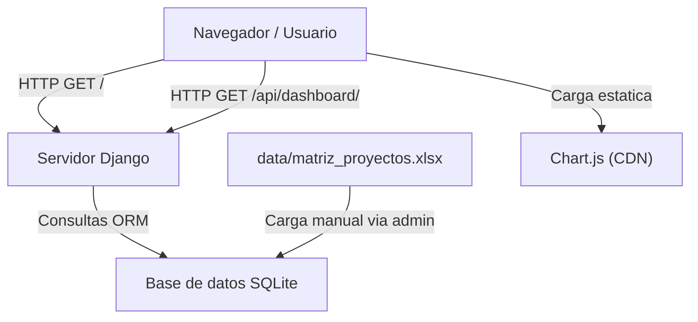
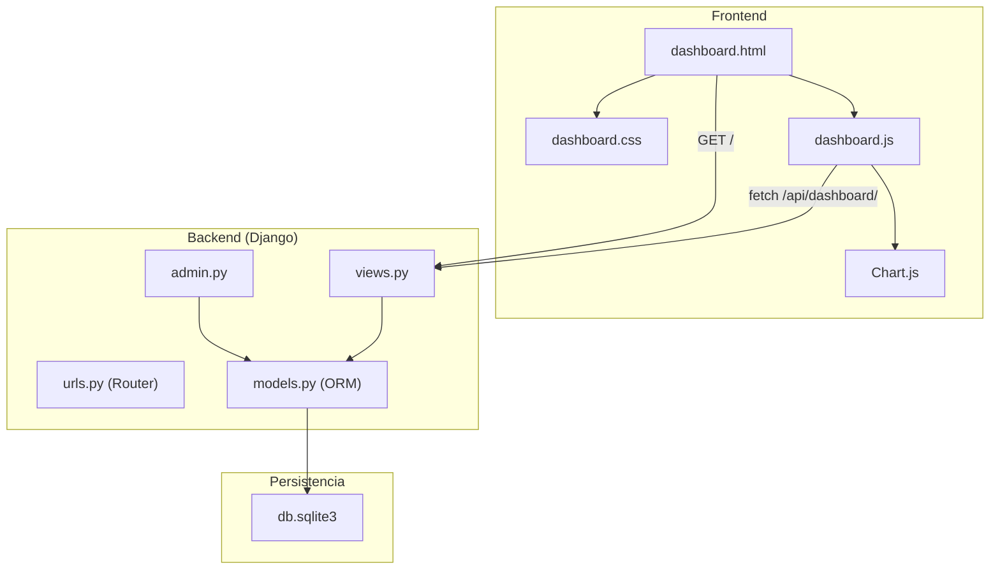
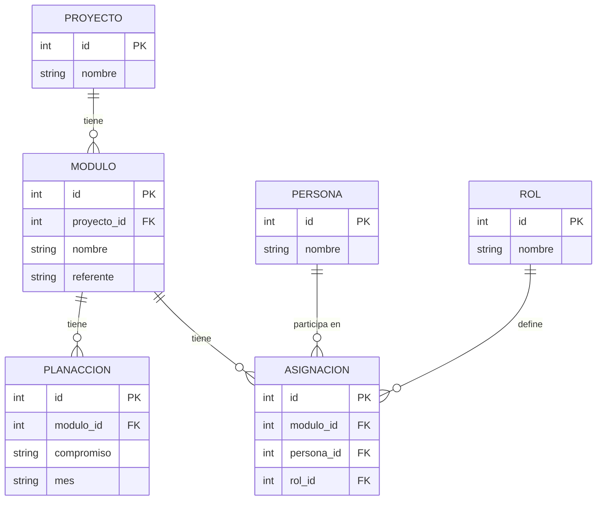
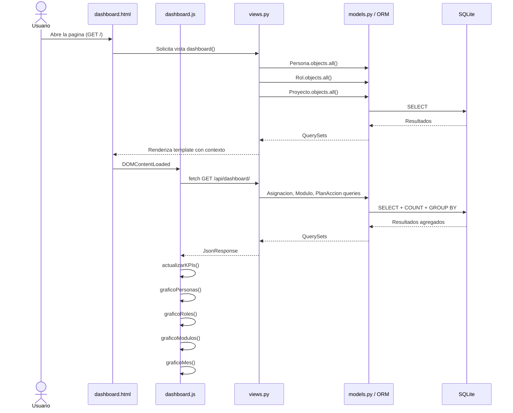
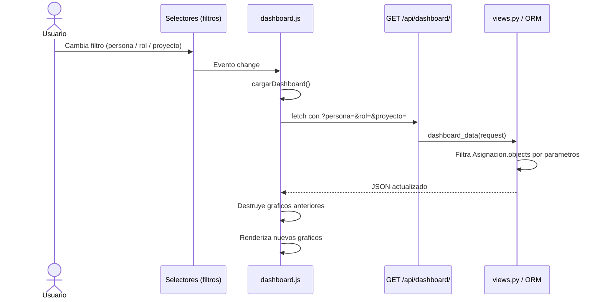
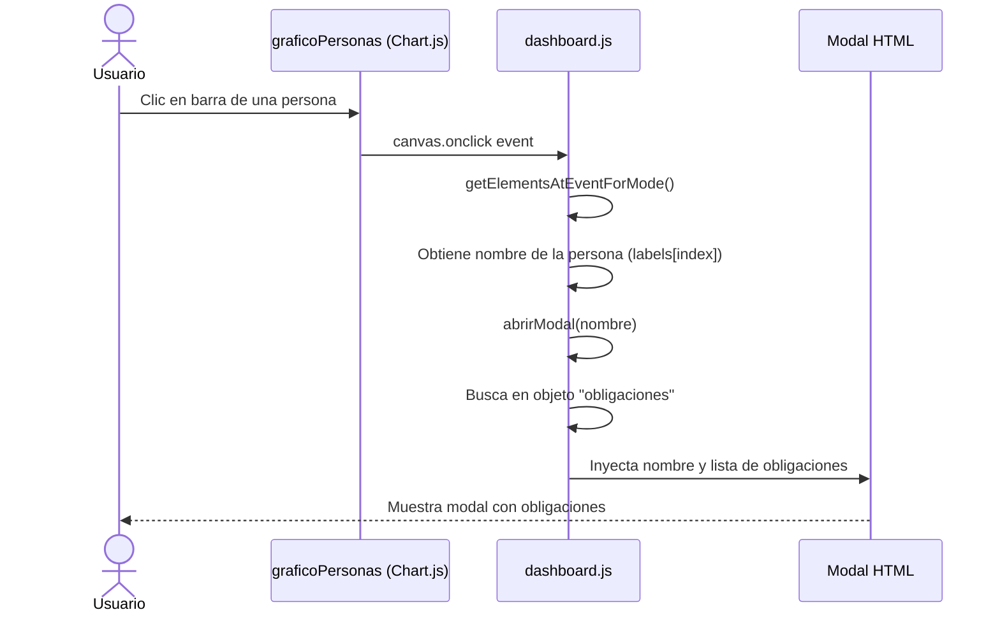
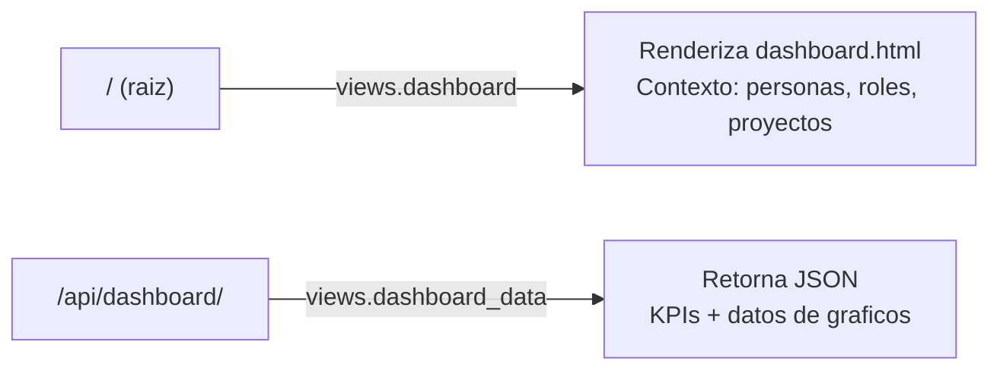
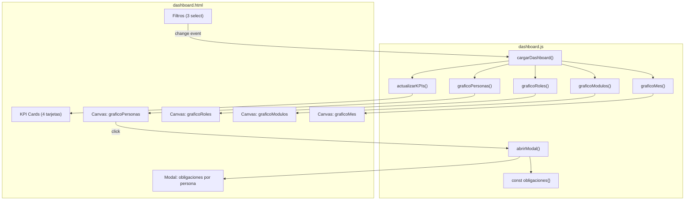
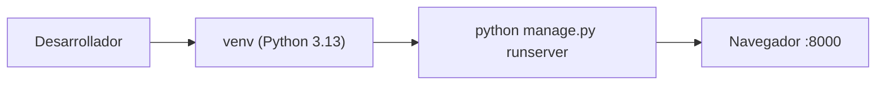

# Arquitectura de Software - Dashboard de Proyectos SRNI

---

## 1. Vista general del sistema

---

## 2. Arquitectura de capas

---

## 3. Modelo de datos (Entidad-Relacion)

---

## 4. Flujo de datos - Carga del dashboard

---

## 5. Flujo de datos - Filtros

---

## 6. Flujo - Modal de obligaciones

---

## 7. Estructura de URLs

---

## 8. Componentes del frontend

---

## 9. Despliegue (desarrollo)

