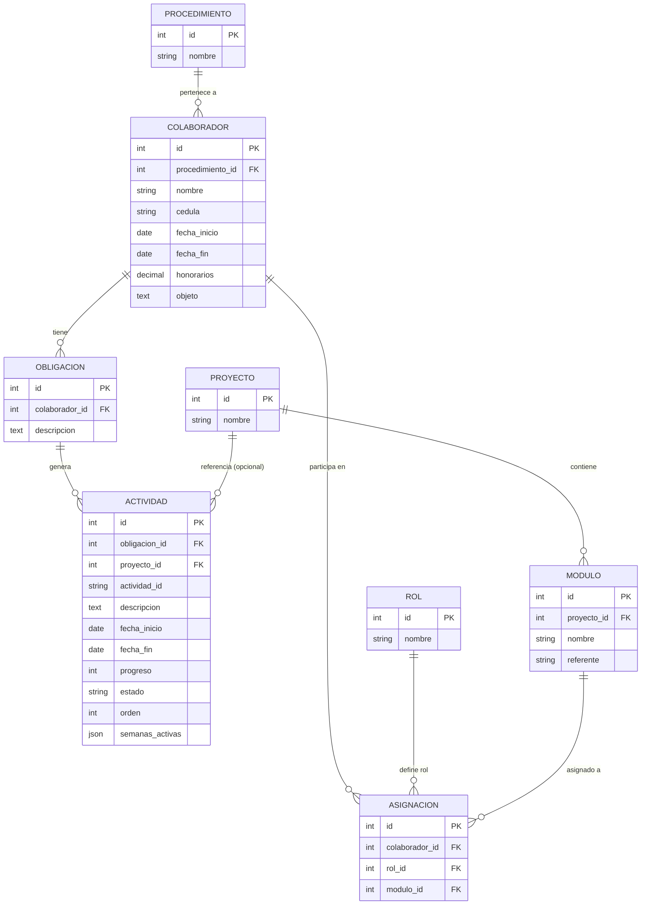
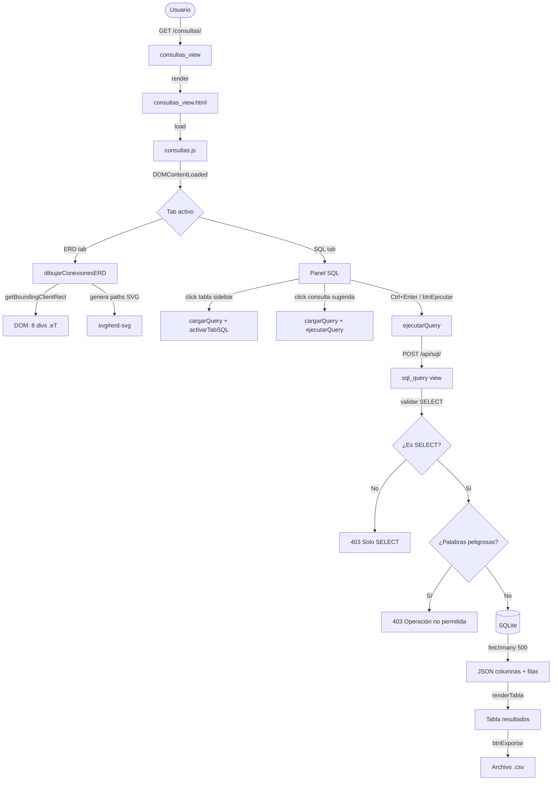
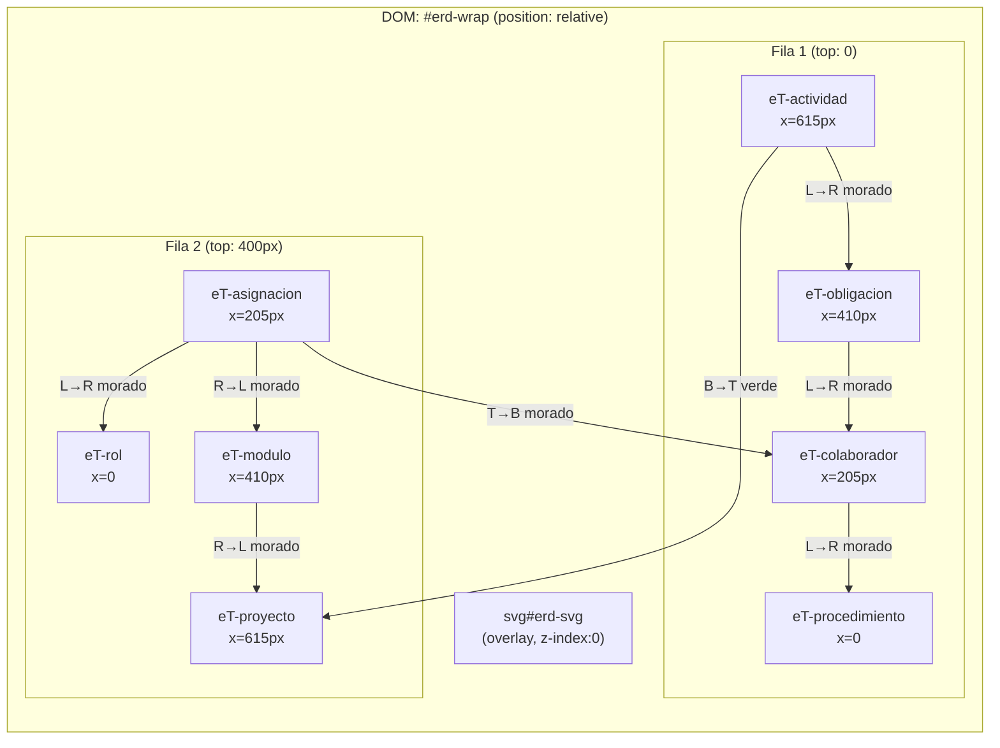
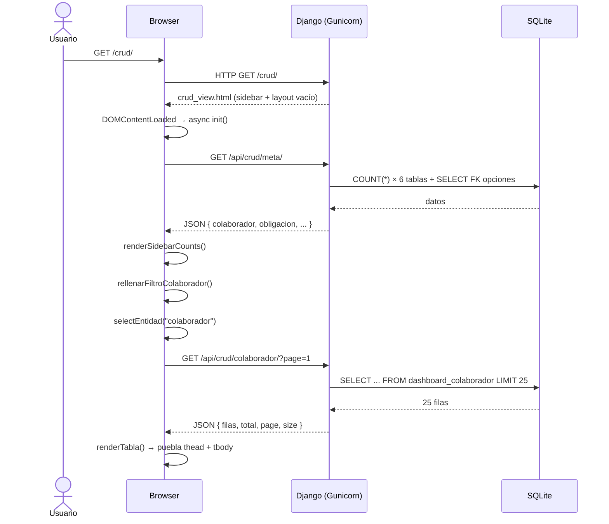
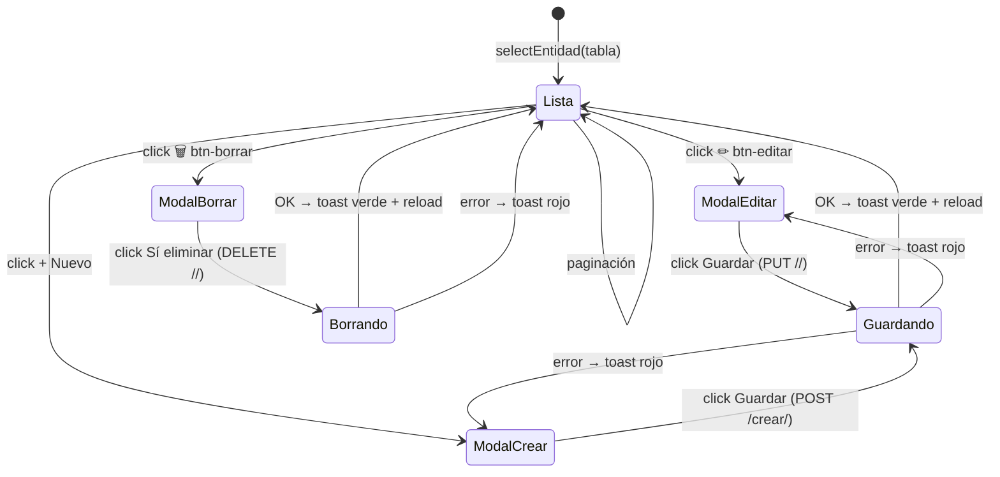
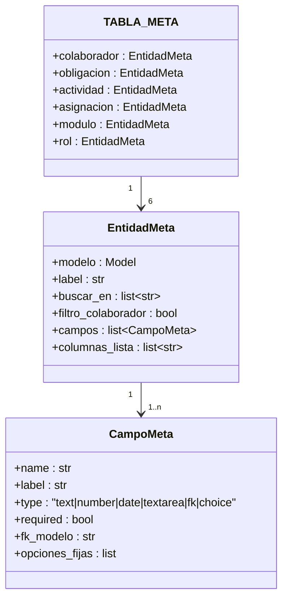
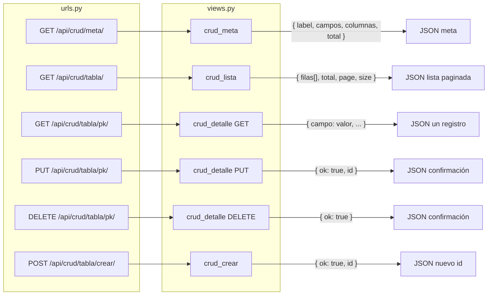
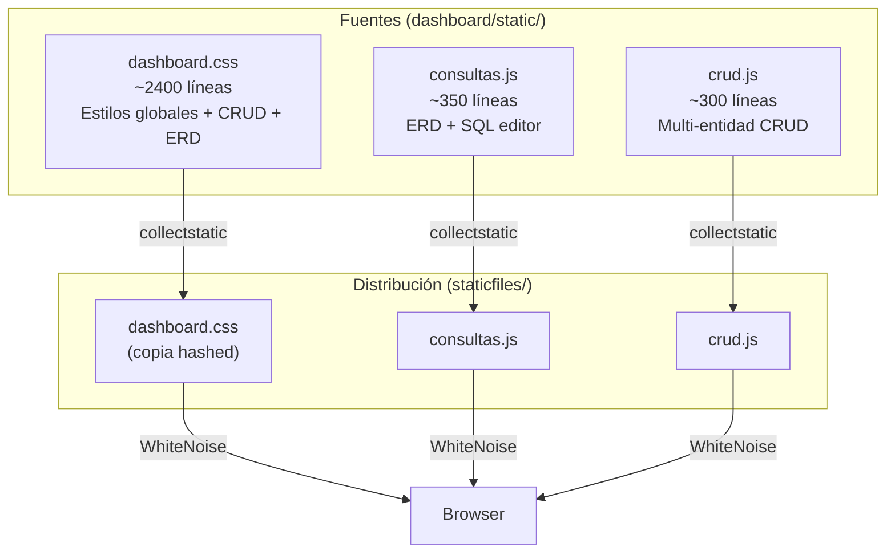
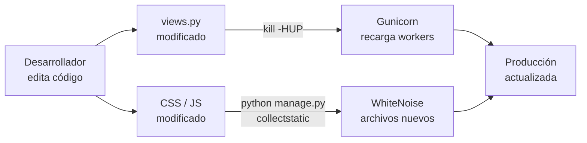
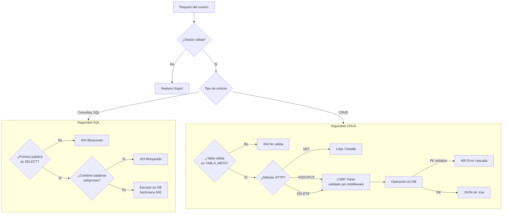

# Arquitectura — Módulos Consultas SQL y Gestión CRUD
**Sistema:** SRNI 2026  
**Fecha:** Abril 2026  

---

## 1. Modelo de datos (ERD completo)

---

## 2. Arquitectura del módulo Consultas SQL

### 2.1 Flujo completo de la aplicación

### 2.2 Estructura de componentes del tab ERD

---

## 3. Arquitectura del módulo Gestión CRUD

### 3.1 Flujo de inicio y carga inicial

### 3.2 Flujo de operaciones CRUD

### 3.3 Registro de entidades (TABLA_META)

### 3.4 API REST del módulo CRUD

---

## 4. Arquitectura de archivos estáticos

---

## 5. Despliegue y proceso de actualización

---

## 6. Seguridad

