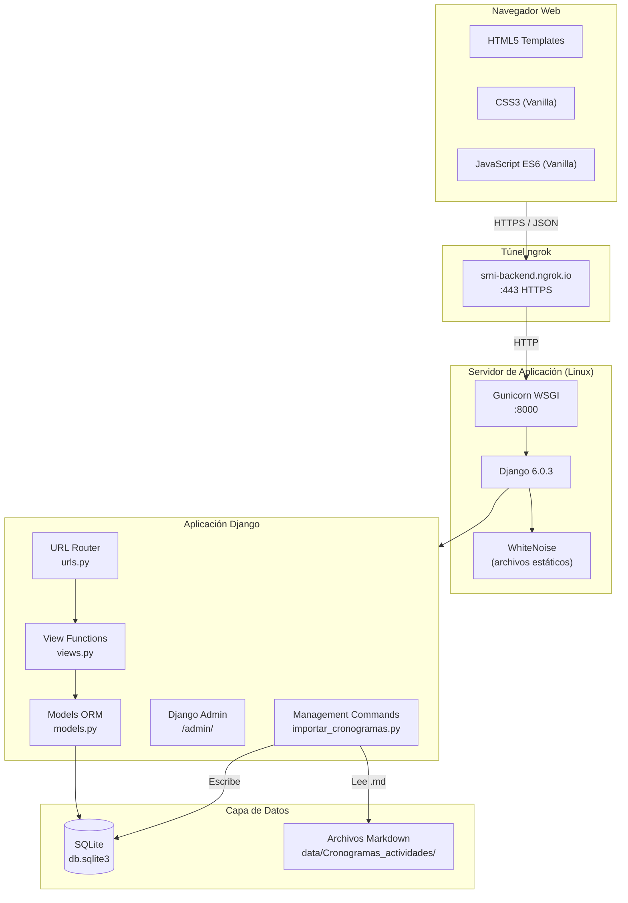
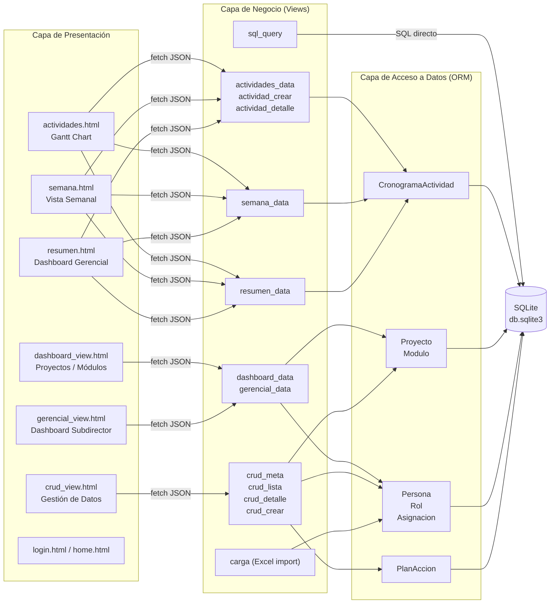
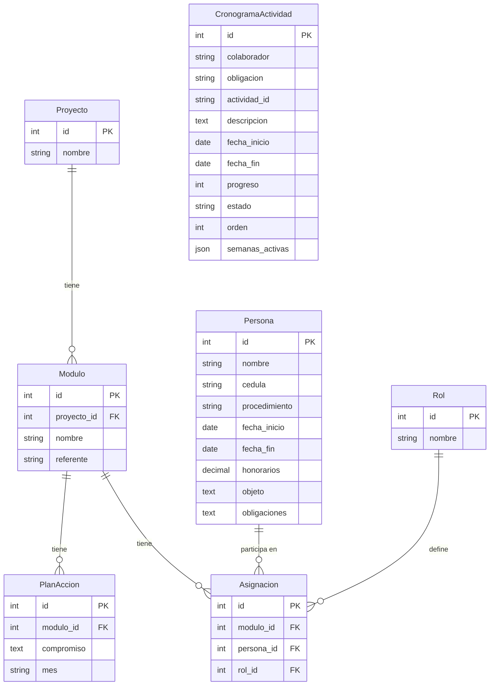
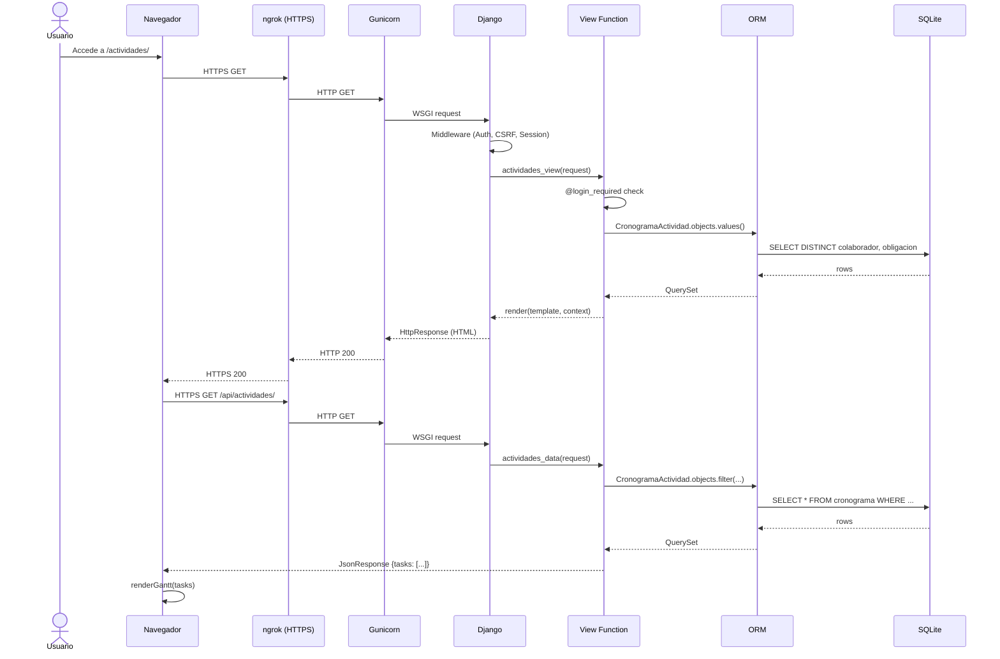
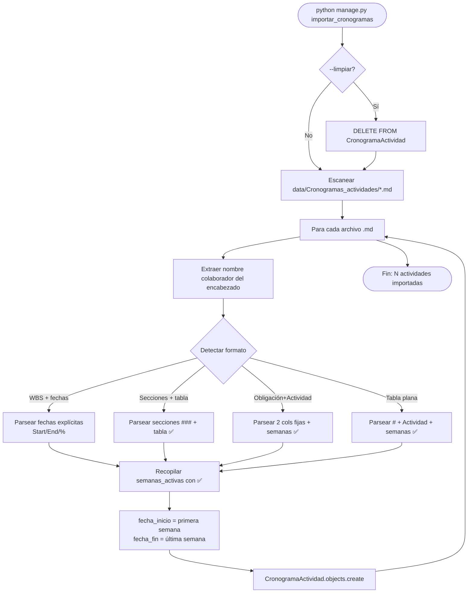
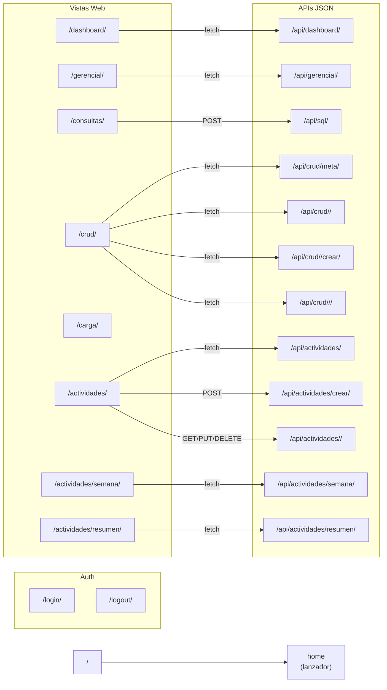
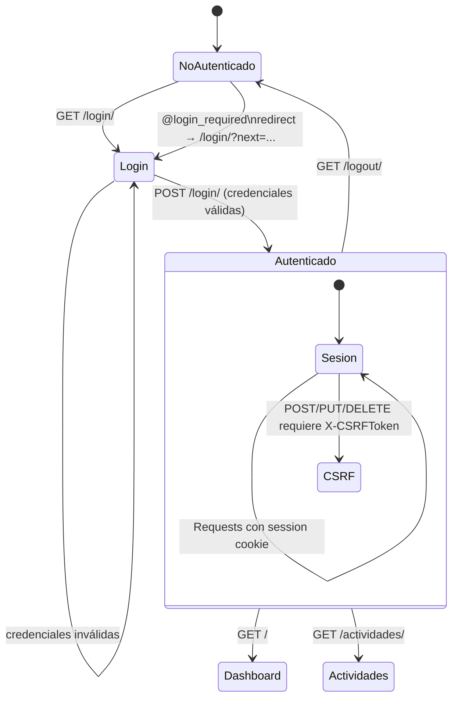
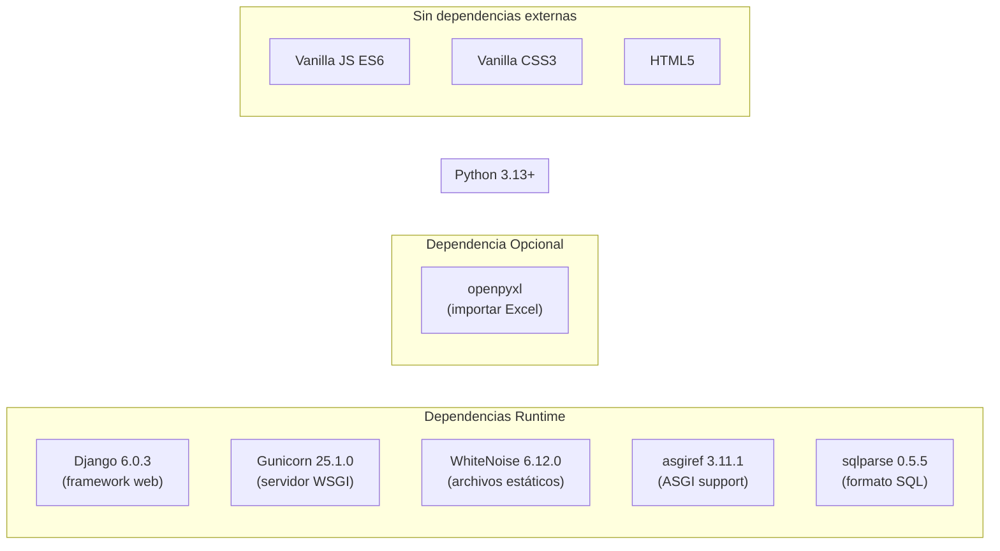
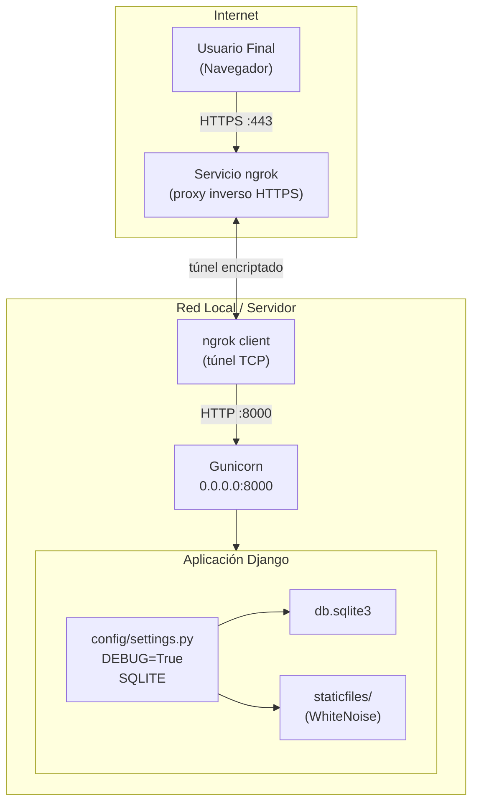

# Arquitectura de Software — SRNI 2026 Dashboard
**Sistema:** Dashboard de Instrumentalización — Subdirección Red Nacional de Información
**Fecha:** Marzo 2026
**Versión:** 1.0

---

## 1. Visión General del Sistema



---

## 2. Arquitectura de Capas



---

## 3. Modelo de Datos (ERD)



---

## 4. Flujo de Petición HTTP



---

## 5. Flujo de Importación de Cronogramas



---

## 6. Mapa de URLs



---

## 7. Módulo Actividades — Componentes Frontend

```mermaid
graph TB
    subgraph actividades_html["actividades.html"]
        TOOLBAR["Toolbar\n(filtros + botones)"]
        STATS["Stats Bar\n(KPI badges)"]
        GANTT["Gantt Chart\n(.gantt-scroll-x)"]
        TABLA["Detail Table\n(#tabla-actividades)"]
        MODAL["Modal\n(crear / editar)"]
    end

    subgraph actividades_js["actividades.js"]
        TIMELINE["TIMELINE config\n(2026-01-01 → 2026-12-31)"]
        RENDER_H["renderTimelineHeader()"]
        RENDER_G["renderGantt(tasks)"]
        RENDER_T["renderTabla(tasks)"]
        RENDER_S["renderStats(tasks)"]
        HOY["renderHoyLine()"]
        COLOR["colorColaborador(nombre)"]
        LOAD["cargarDatos()\nGET /api/actividades/"]
        MODAL_JS["abrirModal() / cerrarModal()\nPOST/PUT /api/actividades/"]
    end

    TOOLBAR -->|onChange| LOAD
    LOAD -->|tasks[]| RENDER_G & RENDER_T & RENDER_S
    RENDER_G --> GANTT
    RENDER_T --> TABLA
    RENDER_S --> STATS
    RENDER_H --> GANTT
    HOY --> GANTT
    COLOR --> RENDER_G
    MODAL_JS --> MODAL
    GANTT -->|click bar| MODAL_JS
    TABLA -->|click edit| MODAL_JS
```

---

## 8. Gestión de Autenticación y Sesiones



---

## 9. Dependencias del Proyecto



---

## 10. Despliegue



> **Nota de producción:** Para un despliegue productivo se recomienda reemplazar SQLite por PostgreSQL, configurar `DEBUG=False`, usar una `SECRET_KEY` segura y considerar un servidor proxy como Nginx en lugar del túnel ngrok.
